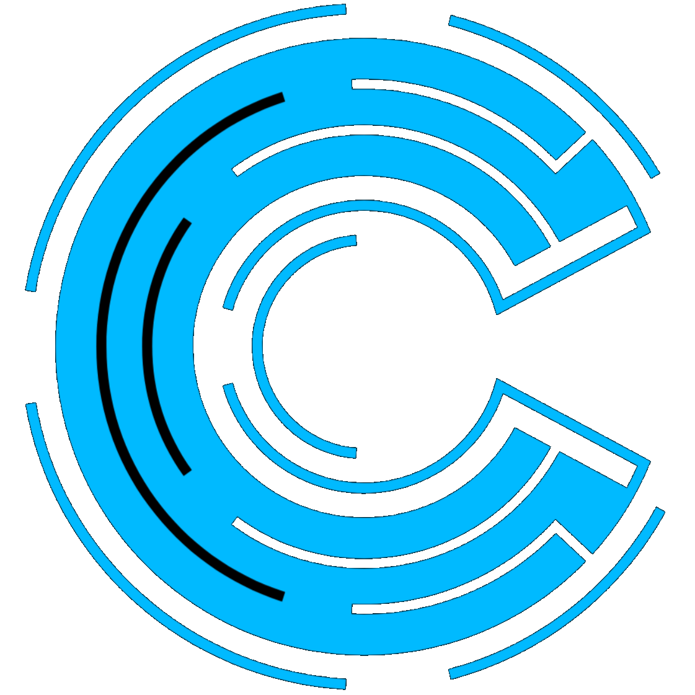

<p align="center">
    &nbsp;
    &nbsp;
    &nbsp;
    &nbsp;
</p>

<p align="center">
  
</p>
<h1 align="center">LNKR by Codist</h1>

# Intro

LNKR is a free URL Shortening Service (free as in free beer free 😄) written using NextJS.

## Getting Started

### Local Development

```bash
# Install the deps
yarn

# Launch the app
yarn dev
```
